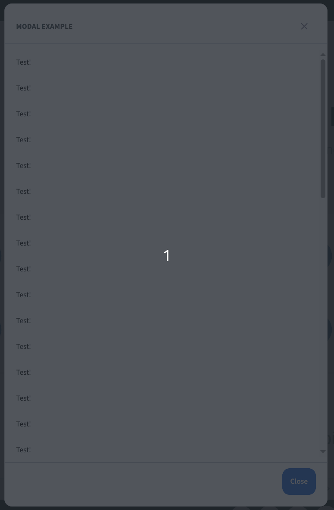

# BBBModal

A customizable modal dialog component for React, following the BBB UI design system.



## Description

`BBBModal` displays content in a modal overlay, with optional title, dividers, scrollable body, and sticky footer. It supports accessibility features and can be fully customized via props.


## Usage Example

```tsx
import { BBBModal } from 'bbb-ui-components-react';

<BBBModal
  isOpen={isOpen}
  onRequestClose={handleClose}
  title="Example Modal"
  showDividers
  footerContent={<button onClick={handleClose}>Close</button>}
>
  <p>This is the modal content.</p>
</BBBModal>
```

## Props

| Prop                        | Type                           | Default   | Description                                                                 |
|-----------------------------|--------------------------------|-----------|-----------------------------------------------------------------------------|
| `isOpen`                    | `boolean`                      | `true`    | Controls whether the modal is open.                                         |
| `onRequestClose`            | `() => void`                   | —         | Function called when requesting to close the modal.                         |
| `appElement`                | `HTMLElement \| string`        | —         | App element for accessibility.                                              |
| `title`                     | `string`                       | —         | Modal title.                                                                |
| `contentLabel`              | `string`                       | —         | Accessibility label for modal content.                                      |
| `showDividers`              | `boolean`                      | `false`   | Shows dividers between header, body, and footer.                            |
| `shouldCloseOnOverlayClick` | `boolean`                      | `false`   | Allows closing when clicking outside the modal.                             |
| `shouldCloseOnEsc`          | `boolean`                      | `false`   | Allows closing with ESC key.                                                |
| `allowScroll`               | `boolean`                      | `true`    | Enables scroll in the modal body.                                           |
| `noFooter`                  | `boolean`                      | `false`   | Hides the modal footer.                                                     |
| `footerContent`             | `React.ReactNode`              | `null`    | Custom content for the footer.                                              |
| `stickyFooter`              | `boolean`                      | `true`    | Makes the footer sticky.                                                    |
| `children`                  | `React.ReactNode`              | —         | Modal content.                                                              |

See [`ModalProps`](./types.ts) for full type definitions.

## Accessibility
- The `appElement` and `contentLabel` props help ensure accessibility compliance.
- The modal can be closed with ESC or by clicking outside, if enabled.

## Customization
- Use the `footerContent` prop to add custom actions or information to the modal footer.
- The `stickyFooter` prop keeps the footer visible when scrolling.

---

For more details, see the [types file](./types.ts) and the [component implementation](./component.tsx).
